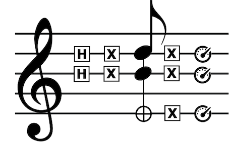

## Fri 19 and Sat 20 November, 2021 
## Online Event

# Introduction
### 1st International Symposium on Quantum Computing and Musical Creativity

Quantum computing is a nascent technology, which is advancing rapidly. 

There is a long history of research into using computers for music since the 1950s. Nowadays computers are essential for the music economy. Therefore, it is very likely that quantum computers will impact the music industry in the time to come. A new area of research and development is emerging: _Quantum Computer Music_.

This first-ever quantum computer music symposium focuses on quantum computing for musical creativity. It takes place in the context of the [QuTune Project](https://iccmr-quantum.github.io/), and is organised by [University of Plymouth's ICCMR](http://cmr.soc.plymouth.ac.uk/) in collaboration with [Cambridge Quantum Computing](https://cambridgequantum.com/) and [IBM Quantum](https://www.ibm.com/quantum-computing/). In addition to creating resources for quantum computer music, QuTune is aimed at fostering a quantum-ready music tech community of early adopters.

The programme comprises talks about the resources being developed by the QuTune team, invited presenters and presentations submitted by the research community. It offers a hands-on introduction to programming quantum computers for musicians and enthusiasts, and practical demonstrations. We welcome proposals for presentations (see [How to participate](#how-to-participate) below).

The symposium will take place online and attendance is free of charge. Places are limited, __registration is required__. Registration information will be posted here in due time. Please watch this space. 

# Organising Team
- Eduardo R. Miranda (ICCMR, University of Plymouth, UK)
- Bob Coecke (Cambridge Quantum Computing, UK)
- Ilyas Khan (Cambridge Quantum Computing, UK)
- Sieglinde Pfaendler (IBM Quantum, Europe)
- Fabio Scafirimuto (IBM Quantum, Switzerland)
- Omar Costa Hamido (ICCMR, University of Plymouth, UK)
- Paulo Itaborai (ICCMR, University of Plymouth, UK)
- Suchitra Basak (ICCMR, University of Plymouth, UK)
- Scott Oshiro (CCRMA, Stanford University, USA)
- Enrique Solano (Kipu Quantum, Germany)

# How to participate

The target audience for this symposium is musicians interested in reflecting on and experimenting with quantum computers for musical composition and/or performance. Quantum computing developers and researchers interested in music are welcome. 

A background in computer music and/or music technology is recommended in order to follow the presentations. Previous experience with computer programming, in particular Python, is also recommended to benefit from the tutorial. Familiarity with quantum computing is not mandatory, but would be advantageous. ([Here](https://www.ibm.com/quantum-computing/what-is-quantum-computing/) is a good place to start. A good popular science explanation with a short video is [here](https://www.quantamagazine.org/why-is-quantum-computing-so-hard-to-explain-20210608/)).

To express your interest in participating, please fill in the form (link to access the form has expired).  The organizing team will contact you after the application deadline with further instructions to access the event.

We are very keen to welcome those who already have been working with quantum computer music to present their work. If you wish to present, then please let us know. There is space on the form to briefly describe the work that you would like to present. Should you qualify for a presentation, then we will send you instructions for writing a short paper. We are planning to publish a selection of papers as a special issue of _Contemporary Music Journal_.

__NOTE: The deadline to submit papers for presentation expired on 03 September 2021. If you just want to watch the presentations and tutorial, don't panic! Instructions for registering to watch the presentations and tutorial will be posted on this webpage soon.__

In the meantime, for more information: contact.isqcmc@gmail.com

# Programme

Note: <u>Times in GMT (London, UK time zone)</u> (see in [your own time zone](https://www.inyourowntime.zone/2021-11-19_09.00_Europe.London))

# DAY 1: 19 Nov 2021 

09:00 - 9:50: **Welcome and Introduction to QuTune Project**
- _Eduardo R. Miranda and Bob Coecke_ 

### Tutorial I (10:00 - 12:00)

10:00 - 12:00: **Introduction to Quantum Computing for Musicians – Part 1**
- _Omar Costa Hamido_ (University of Plymouth, UK)

### Research Papers Session I (13:00 – 15:00)

13:00 – 13:30: **Conceptualizing Quantum Music**
- _Karl Svozil_ (TU Wien, Austria)
 

13:30 – 14:00: **Composing with Quantum Walks and the Basak-Miranda Algorithm**
- _Suchitra Basak_ (University of Plymouth, UK)

14:00 – 14:30: **Quantum of Sound, the Sound of Quanta**
- _Maria Mannone_ (University of Palermo & Ca’ Foscari University of Venice, Italy)
- _Davide Rocchesso_ (University of Palermo, Italy)

14:30 – 15:00: **Quantum Machine Learning of Music with Meaning**
- _Eduardo R. Miranda_ (University of Plymouth, UK)
- _Richie Yeung_ (Cambridge Quantum, UK)
- _Anna Pearson_ (Cambridge Quantum, UK)
- _Konstantinos Meichanetzidis_ (Cambridge Quantum, UK)
- _Bob Coecke_ (Cambridge Quantum, UK)

### Research Papers Session II (15:30 –  18:00)

15:30 – 16:00: **Quantum Cellular Automata Music**
- _Hector Miller-Bakewell_

16:00 – 16:30: **Playing Superconductive Qubits as Musical Synthesizers for Live Performance**
- _Spencer Topel_ (Yale Quantum Institute, USA)
- _Luke Burkhart_ (Yale Quantum Institute & Keysight Technologies, USA)
- _Kyle Serniak_ (Yale Quantum Institute & MIT Lincoln Laboratory, USA)
- _Florian Carle_ (Yale Quantum Institute, USA)

16:30 – 17:00: **Exploring the Application of Gate-type Quantum Computational Algorithm for Music Creation and Performance**
- _Satofumi Souma_ (Kobe University, Japan)

17:00 – 17:30: **Making Music Using Two Quantum Algorithms**
- _Euan J. Allen_ (University of Bristol, UK)
- _Jacob F. F. Bulmer_ (University of Bristol, UK)
- _Simon Small_

17:30 – 18:00: **QuiKo: Quantum Beat Generation**
- _Scott Oshiro_ (Stanford University, USA)

### Musical Demonstrations (18:30 - 19:30)

18:30 – 19:30: **t.b.a.**
- Convener: _Eduardo R. Miranda_ (University of Plymouth, UK)

#  DAY 2: 20 Nov 2021

### Tutorial II (09:00 - 10:30)

09:00 - 10:30: **Introduction to Quantum Computing for Musicians – Part 2**
- _Omar Costa Hamido_ (University of Plymouth, UK)

### Research Papers Session III (11:00 – 12:00)

11:00 – 11:30: **Quantum Audio Representations**
- _Paulo Itaboraí_ (University of Plymouth, UK)

11:30 – 12:00: **Quantum Frequency Detector for Audio Files**
- _Rajiv Mistry_ (Pivotport, USA)
- _Jonathan Ortega_ (Purdue University, USA)

### Research Papers Session IV (13:00 - 14:30)

13:00 – 13:30: **Photonic Sound Synthesis**
- _Eduardo R. Miranda_ (University of Plymouth, UK)
- _Paul Finlay_ (Xanadu, Toronto, Canada)
- _Tom Lubowe_ (Xanadu, Toronto, Canada)

13:30 – 14:00: **Applications of Quantum Annealing to Music Theory**
- _Özlem Salehi Köken_ (Polish Academy of Sciences, Poland)
- _Ludmila Botelho_ (Polish Academy of Sciences and Silesian University of Technology, Poland)
- _Ashish Arya_ (QWorld Organization)
- _Fabiola Cañete_ (Benemérita Universidad Autónoma de Puebla, Mexico)
- _Dhruvi Kapadia_ (Sarvajanik College Of Engineering and Technology, India)

14:00 – 14:30: **Quantum Adiabatic Computing and Applications to Music**

- _Jake M. Chuharski_ (MIT, USA)

### QuTune Brainstorming Session (15:00 - 18:00)
Working groups by invitation only

15:00 – 18:00: **t.b.c.**

### Demonstration (18:30 – 19:30) 

18:15 – 19:15: **Software - Quantum Music Playground**
- _James Weaver_ (IBM Quantum, USA)

### Announcements and Goodbye (19:30 - 19:45)

19:15 - 19:45: **t.b.c.**
- _Organising team_
